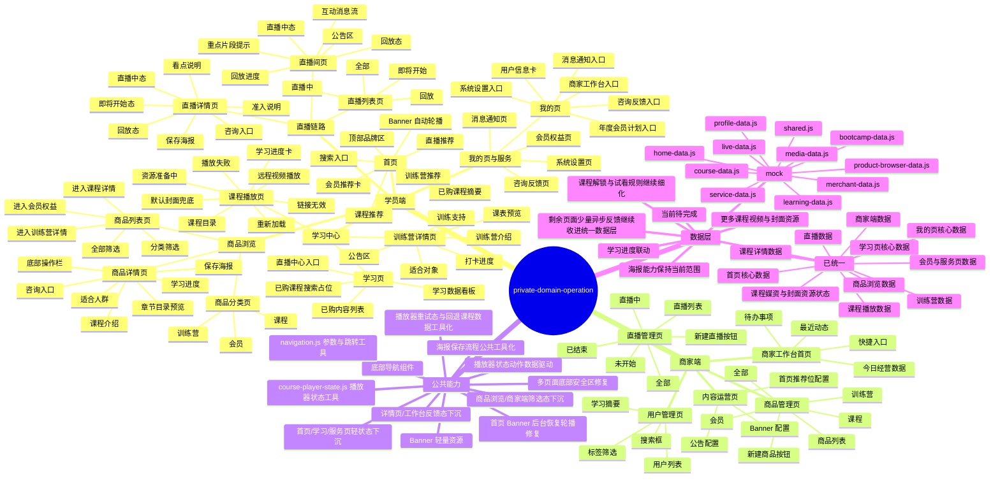

# 功能思维导图

文档版本：`v0.10`

更新日期：`2026-05-06`

关联文档：

- [IMPLEMENTATION_TRACKER.md](./IMPLEMENTATION_TRACKER.md)
- [README.md](../README.md)

## 1. 文档说明

这份文档用于把当前 `private-domain-operation` 已实现的功能按模块整理成一张思维导图，方便快速查看功能分布。

如果当前 Markdown 查看器支持 `Mermaid`，可直接查看下方思维导图；如果不支持，也可以使用后面的文字树状结构阅读。

## 2. Mermaid 思维导图



## 3. 文字树状结构

```text
private-domain-operation
├── 学员端
│   ├── 首页
│   │   ├── 顶部品牌区 / 搜索入口 / Banner 自动轮播
│   │   ├── 已购课程摘要
│   │   ├── 课程推荐
│   │   ├── 训练营推荐
│   │   ├── 直播推荐
│   │   └── 会员推荐卡
│   ├── 商品浏览
│   │   ├── 商品分类页
│   │   ├── 商品列表页
│   │   └── 商品详情页
│   │       └── 保存海报
│   ├── 学习中心
│   │   ├── 学习页
│   │   ├── 课程播放页
│   │   └── 训练营详情页
│   ├── 直播链路
│   │   ├── 直播列表页
│   │   ├── 直播详情页
│   │   │   └── 保存海报
│   │   └── 直播间页
│   └── 我的页与服务
│       ├── 我的页
│       ├── 会员权益页
│       ├── 消息通知页
│       ├── 咨询反馈页
│       └── 系统设置页
├── 商家端
│   ├── 商家工作台首页
│   ├── 商品管理页
│   ├── 直播管理页
│   ├── 用户管理页
│   └── 内容运营页
├── 公共能力
│   ├── 底部导航组件
│   ├── Banner 轻量资源
│   ├── 多页面底部安全区修复
│   ├── 首页 Banner 后台恢复轮播修复
│   ├── navigation.js 参数与跳转工具
│   ├── course-player-state.js 播放器状态工具
│   ├── 首页/学习/服务页轻状态下沉
│   ├── 商品浏览/商家端筛选态下沉
│   └── 详情页/工作台反馈态下沉
├── 数据层
│   ├── mock/shared.js
│   ├── mock/media-data.js
│   ├── mock/home-data.js
│   ├── mock/learning-data.js
│   ├── mock/profile-data.js
│   ├── mock/course-data.js
│   ├── mock/bootcamp-data.js
│   ├── mock/live-data.js
│   ├── mock/merchant-data.js
│   ├── mock/service-data.js
│   ├── mock/product-browser-data.js
│   └── 已统一：首页 / 学习 / 我的 / 训练营 / 直播 / 商家端 / 会员 / 服务页 / 课程媒资
└── 当前待完成
    ├── 学习进度联动
    ├── 课程解锁与试看规则继续细化
    ├── 剩余页面少量异步反馈继续收进统一数据层
    ├── 海报能力保持当前范围
    └── 更多课程视频与封面资源
```
